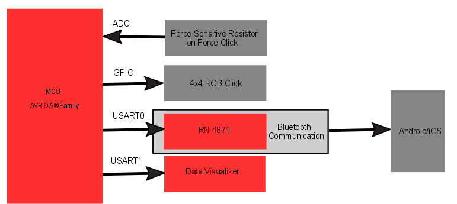
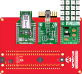
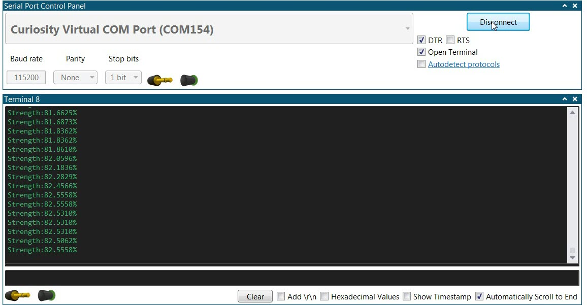
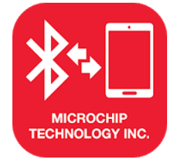
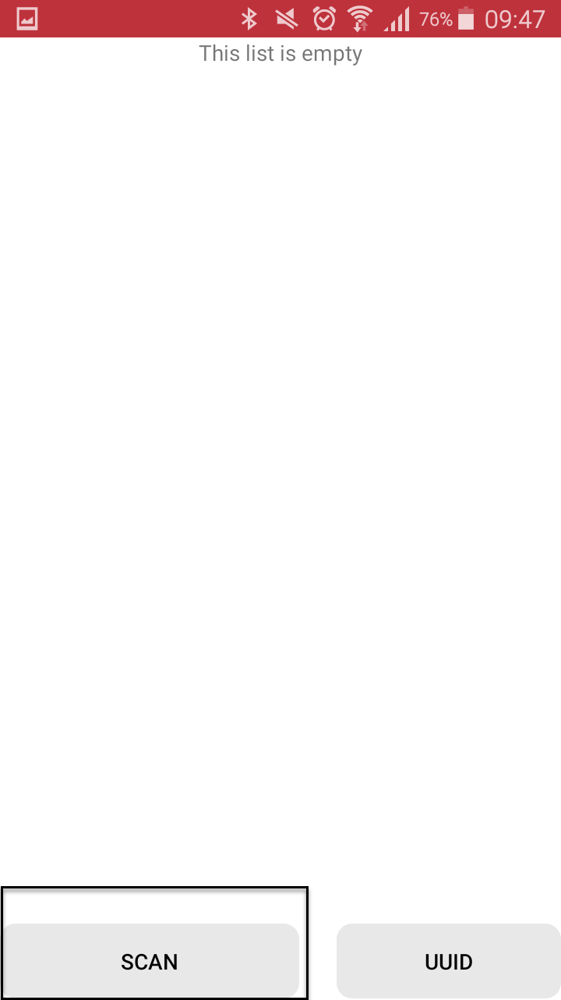
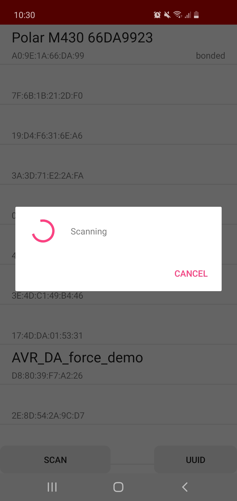
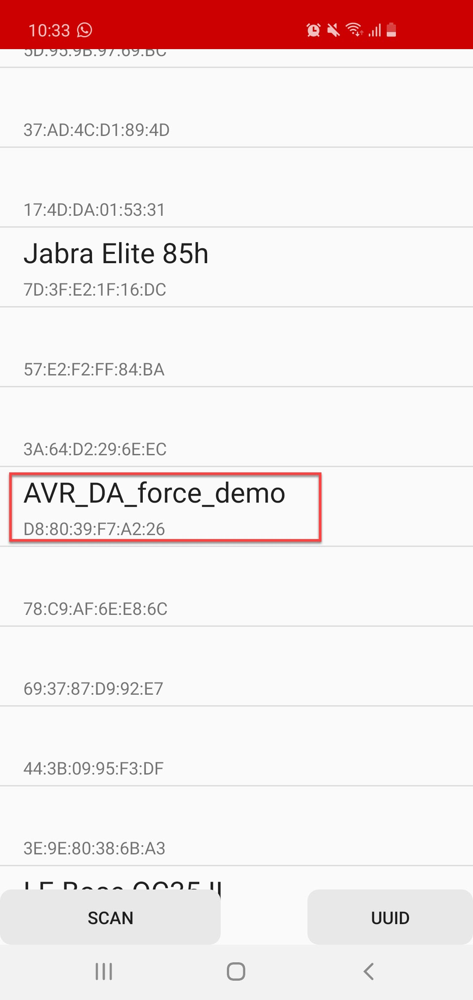
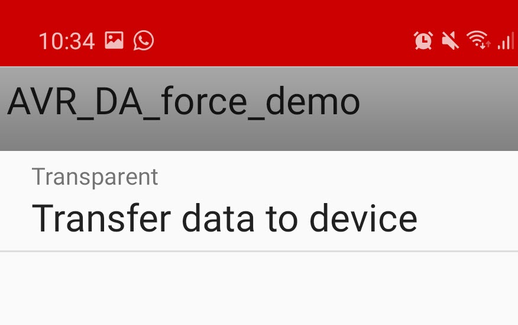

<!-- Please do not change this logo with link -->

# How to use Force Sensitive Resistor with 12-bit ADC

This application note describes how to use the ADC on AVR DA® Family microcontrollers to measure a Force Sensitive Resistor. The ADC supports sampling in bursts where a configurable number of conversion results are accumulated into a single ADC result (sample accumulation). This feature is used in the example application to accumulate 128 samples and perform averaging.

In the example application, three types of visualization with the ADC result:
 - The ADC result will be sent to an android/iOS app over Bluetooth communication using the RN4870/71 Click board.
 - The ADC result will also be sent to a serial terminal
 - 4x4 RGB Click board is used to illuminate different LEDs as per applied force on force sensitive resistor.  The number of LEDs which are illuminated, and brightness of LEDs are proportional to applied force.

## Related Documentation

- [AN3408 - How to use Force Sensitive Resistor with 12-bit ADC](https://microchip.com/DS00003408)
  - Note: AN3408 application note is for tinyAVR® 2 Family microcontrollers. It can also be referred for AVR DA code example. ADC configurations differ for AVR DA® and tinyAVR® 2 Family microcontrollers.
- [AVR DA device page](https://www.microchip.com/wwwproducts/en/AVR128DA48) 

## Block Diagram

  

## Software Used

- Microchip Studio ® 7.0.2537 or newer [(microchip.com/mplab/microchip-studio)](https://www.microchip.com/mplab/microchip-studio)
- Android or iOS app Microchip Bluetooth Data:
  - [(Microchip Bluetooth Data: Android)](https://play.google.com/store/apps/details?id=com.microchip.bluetooth.data&hl=en)
  - [(Microchip Bluetooth Data: iOS)](https://apps.apple.com/us/app/microchip-bluetooth-data/id1319166097)
- Data Visualizer extension in Microchip Studio [(Data Visualizer)](https://gallery.microchip.com/packages/AtmelDataVisualizerInstaller-Standalone/)
  - Note: Any other serial terminal on PC can also be used
- AVR DA Device support (AVR-Dx DFP 1.6.76) or newer 

## Hardware Used

- AVR128DA48 Curiosity Nano [(DM164151)](https://www.microchip.com/developmenttools/ProductDetails/DM164151)
- Curiosity Nano Base for Click boards™ [(AC164162)](https://www.microchip.com/Developmenttools/ProductDetails/AC164162)
- Force Click board™ [(MIKROE-2065)](https://www.mikroe.com/force-click)
- RN4870 Click board™ [(MIKROE-2543)](https://www.mikroe.com/rn4870-click)
  - RN4871 Click can also be used
- 4x4 RGB Click board™ [(MIKROE-1881)](www.mikroe.com/4x4-rgb-click)

## Setup

- Connect the AVR128DA48 Curiosity Nano on Curiosity Nano Adapter Board
- Connect RN4870 or RN4871  Click on the Slot1 on Curiosity nano Adapter Board
- Connect Force Click  on the Slot2 on Curiosity nano Adapter Board
- Connect 4x4 RGB Click on the Slot3 on Curiosity nano Adapter Board

## Pin Configuration and Click Board

Curiosity Nano Adapter Slot   | Click Board | Curiosity Nano Adapter Pin Name  | MCU Pin name  |
----------------------------- |-------------|----------------------------------|---------------
              Slot1           | RN4870 Click /RN4871 Click   | RST1 (HW Reset), RX1, TX1 |  PD7, PA1, PA0      |
              Slot2           | Force Click  | AN2 |      PD4
              Slot3           | 4x4 RGB Click  | CS3 (Switch position IN2 on Click board) | PE3      |

## Operation

In this demo, ADC measurements are done using force sensitive Resistor(FSR) on the Force Click board. When force is applied to the
FSR on the Force Click board, an ADC result is read which is proportional to the applied force.
Note:  In test setup, VDD = 3.3V, ADC reference is VDD. When maximum force is applied on Force sensor, the
voltage on ADC pin is 3.261V which is 100% strength. It may vary from setup to setup.
The strength percentage is calculated and sent to an Android or iOS app over Bluetooth communication using the
RN4870 Click board. The ADC result is sent also to Data Visualizer (or PC serial terminal) and a 4x4 RGB Click
board is used to illuminate different LEDs corresponding to the applied force on the FSR. The number of LEDs
illuminated and the brightness of LEDs are proportional to the applied force.

## Hardware and Software Setup

  1. Connect the boards as mentioned in Section 'Setup'.
  1. Download and install the Android or iOS app referred to in Section 'Software Used'.
  1. Connect the AVR128DA48 Curiosity Nano to a computer using a USB cable.
  1. Download the application and program the AVR128DA48 Curiosity Nano.

## 4x4 RGB Click, Force Click, Data Visualizer

1. Observe that upon power-up, the 4x4 RGB Click board is illuminated with different color patterns. It displays colors in sequence: Red, Green, White, and then it turns blank.
1. Press the FSR on the Force Click board and observe the LEDs. 
   - Note:  LEDs in blue colors will be illuminated. The number of LEDs illuminated and the brightness of the LEDs are proportional to the applied force.
1. Increase the force on the FSR and observe an increased brightness level and increased number of LEDs illuminated.
1. Open Data Visualizer or any other serial terminal on PC.
1. Connect the Curiosity Virtual COM Port and configure baud rate to 115200. 

        
   

1. Press the FSR on the Force Click board and observe the applied force in percentage.
   - Note:  When 100% force has been applied on FSR, all the LEDs on the 4x4 RGB Click board will keep flashing with different colors. Colors flashed are red, green, blue, magenta, yellow, cyan, and white.

## Bluetooth Communication

   - Note:  This section shows the interface using the Microchip Bluetooth Data android app. Steps are almost similar for iOS app.

1. Install and open the app Microchip Bluetooth Data. 

        
   

1. Click on **BLE UART** and select **BM70**.
1. Click on **Scan**. If a pop-up message appears to turn on Bluetooth, click **Yes** and then click **Scan** again.
1. Click the **Scan** tab to list the devices. 

        
    

1. Wait for the scan for 4-5 seconds, and then click **Cancel** to cancel the scan. 
   - Note:  After canceling the scan, the Bluetooth module name, **AVR_DA_force_demo**, should be listed on the screen. If the name is not listed, go to Step:2, *Click on **BLE UART** and select **BM70*** and repeat the scan 

        
    
 
1. Click on **AVR_DA_force_demo**. 

        
   
 
1. Wait for connection.
1. Click on **Transfer data to device**. 

        
   
 

1. Press the FSR on the Force Click board and observe the applied force in percentage in the app. 

        
   
 

   - Note:  If iOS app is used, enable the checkmark **Display Data** to visualize the data in the app.

## Summary

This example has shown how to measure a force sensitive resistor using the ADC on a AVR DA Family microcontroller, and show the result both using LEDs and sent over Bluetooth and PC serial terminal. 